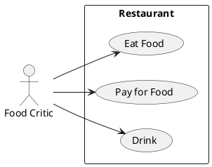

# Описание требований и архитектуры

## Введение
<!-- Общее краткое описание создаваемой системы -->
В рамках курса осуществляется проектирование решения на основе [постановки задачи от "заказчика"](../../task.md).

- [Описание требований и архитектуры](#описание-требований-и-архитектуры)
  - [Введение](#введение)
  - [Заинтересованные стороны](#заинтересованные-стороны)
  - [Бизнес-контекст (бизнес-требования)](#бизнес-контекст-бизнес-требования)
    - [Цели и задачи](#цели-и-задачи)
    - [Бизнес-цели и результаты](#бизнес-цели-и-результаты)
  - [Глоссарий](#глоссарий)
  - [Модель предметной области](#модель-предметной-области)
  - [Требования к системе](#требования-к-системе)
    - [Сценарии использования (Use case)](#сценарии-использования-use-case)
    - [Функциональные требования](#функциональные-требования)
    - [Ключевые бизнес-метрики](#ключевые-бизнес-метрики)
    - [Нефункциональные требования/Требования к атрибутам качества](#нефункциональные-требованиятребования-к-атрибутам-качества)
    - [Ограничения](#ограничения)
  - [Архитектура](#архитектура)
    - [Журнал архитектурных решений](#журнал-архитектурных-решений)
    - [Контекст решения](#контекст-решения)
    - [Компонентная архитектура](#компонентная-архитектура)
    - [Реализация сценариев использования](#реализация-сценариев-использования)
    - [Программные интерфейсы](#программные-интерфейсы)
    - [Схема развертывания](#схема-развертывания)
  
## Заинтересованные стороны
<!-- Перечень заинтересованных сторон и их интересов по отношению к создаваемой системе. 
Подробнее: https://confluence.mts.ru/pages/viewpage.action?pageId=399975538 
-->
| Заинтересованная сторона | Интересы                                                                                                                                                                                            |
| :----------------------- | :-------------------------------------------------------------------------------------------------------------------------------------------------------------------------------------------------- |
| Руководитель проекта     | Сокращение издержек и оптимизация бизнес-процессов при организации и проведении конференций.                                                                                                        |
| Администратор оргкомитета           | Своевременная обработка заявок, удобный инструментарий для формирования расписаний, сбора обратной связи и информирования участников конференций.                                                   |
| Слушатель                | Получение новой информации о практиках использования или внедрениях решений на базе тех или иных технологиях и полученных итоговых результатов.                                                     |
| Докладчик                | Поделиться с аудиторией выводами от использования или внедрения решения на базе тех или иных технологиях, получить обратную связь для улучшения качества и получения признания научным сообществом. |
| Спонсор                  | Рассказать о деятельности организации и представить свои продукты с целью привлечения новых клиентов.                                                                                               |
| Учредитель               | Осуществить научно-методическое сопровождение конференции.                                                                                                                                          |
| Акционер                 | Получение дохода от проведения конференции                                                                                                                                                          |

## Бизнес-контекст (бизнес-требования)
<!-- Общее описание бизнес-контекста создаваемой системы (автоматизируемой деятельности), список бизнес-целей заинтересованных сторон 
Подробнее: https://confluence.mts.ru/pages/viewpage.action?pageId=399973845
-->
Предпосылки (текущее состояние)
Столкнувшись с огромным количеством желающих выступить на конференции и сложным процессом отбора докладов и составления расписания конференции, появилась потребность в автоматизации данной деятельности и создании программного обеспечения, в рамках которого позволила бы  организовать работу со всеми участниками конференций.

### Цели и задачи
Проектируемое решение должно позволять:
- обслуживать поток заявок от желающих выступить на конференции;
- на рецензионной основе, компоновать из допущенных докладов расписание;
- осуществлять сбор оплаты с докладчиков;
- размещать рекламные интеграции от спонсоров на сайте, в личных кабинетах и во время проведения конференции;
- подключать докладчика к онлайн-трансляции выступления;
- осуществлять сбор обратной связи по докладу;
- обслуживать поток заявок от слушателей;
- осуществлять сбор оплаты со слушателей;
- сбор оплаты с докладчиков и слушателей;
- хранение презентационных материалов и записей доклада для скачивания и просмотра;

### Бизнес-цели и результаты
- Прием заявок от желающих выступить должно осуществляться в строго отведенный период и завершиться не позднее, чем за X дней - до запланированной даты проведения конференции. 
- Каждый поданный доклад должен пройти рецензирование на предмет соответствия заявленной тематики и уникальности (антиплагиат).
- По каждому докладчику необходимо собрать соглашения на обработку и хранения персональных данных (152-ФЗ).
- Для обеспечения заполняемости расписания, принятие решение об участии доклада на конференции необходимо принимать на  основании результатов рецензии после окончания периода сбора заявок.
- Докладчик в праве отказать от участия в конференции в любой момент, уведомив организаторов.

## Глоссарий
<!-- Содержит основные понятия и термины предметной области  
Подробнее: https://confluence.mts.ru/pages/viewpage.action?pageId=375782595
-->
| Понятие          | Сокращение |Определение   |
| :--------------- | :--------- | :------------------------------------------- |
| Конференция      |            | Собрание, совещание групп лиц, отдельных лиц, организации для обсуждения определённых тем |
| Доклад           |            | Информативное и лаконичное освещение важной научной проблемы с теоретической и практической сторон оформленное в виде презентационного материала в формате наиболее распространенных форматов файлов.  |
| Расписание       |            | Последовательность выступлений, в хронологической порядке, с допущенными Докладами в привязке к конференции. |
| Рецензия         |            | Результат оценки Доклада по итогам его проверки на предмет соответствия заявленной теме конференций и проверки на Автоплагиат |

## [Модель предметной области](data/data.md)

## Требования к системе

### Сценарии использования (Use case)
<!-- Подробное описание сценариев использования системы с привязкой к ролям участников и задействованным бизнес-сущностям 
https://confluence.mts.ru/pages/viewpage.action?pageId=375782108 
https://confluence.mts.ru/pages/viewpage.action?pageId=375782119 
-->
#### Диаграмма сценариев использования (Use Case Diagram) <!-- omit in toc -->

#### Список сценариев использования <!-- omit in toc -->

| ID     | Описание                                          |
| ------ | ------------------------------------------------- |
| UC.001 | *[Название сценария использования](uc/uc.001.md)* |

### Функциональные требования
<!-- Описание требований к функциям, реализуемым системой. Требование может быть привязано к сценарию использования или быть общим 
Подробнее: https://confluence.mts.ru/pages/viewpage.action?pageId=375782501 
-->
| ID     | Функциональное требование             |
| ------ | ------------------------------------- |
| FR.001 | *Описание функционального требования* |

### Ключевые бизнес-метрики
- Каждая поданная заявка должна получить рецензию.
- Сбор заявок производится 24 часа, а обработка заявок может производится сотрудниками офиса в Москве только в 9 до 21.
- Доклад - объект интелектуальной собственности и необходимо органичить распространение до выступления.
- По требованию регуляторов возможно птребуется доп.проверки.
- Качественное рецензирование и соблюдение ТК РФ.  

### Нефункциональные требования/Требования к атрибутам качества
<!-- Требования к основным архитектурным характеристикам (атрибутам качества) системы - надежность, масштабируемость, ИБ, и др.
Подробнее: https://confluence.mts.ru/pages/viewpage.action?pageId=375782530
-->
| ID     | Атрибут качества             | Описание требования                       |
| ------ | ---------------------------- | ----------------------------------------- |
| QR.001 | Регистрация заявок на Доклад  | Все поданные заявки от Докладчика должны быть приняты и отправлено уведомление о регистрации с номером заявки |
| QR.002 | Время приема заявки на Доклад | Сайт по приему заявок должны быть доступен с 9 утра по МСК до 21 вечера по МСК |
| QR.003 | Мониторинг доступа к Докладу  | Система должна разграничивать доступ к материалам Доклада. До выступления, доступ имеет только Администратор в рамках рецензирования. Регистрировать каждый просмотр файла. Запрет на скачивание.|
| QR.004 | Время подключения Доп.проверки | Предусмотреть возможность поключать внешнии проверки контекста на предмет запрещенного контента. |
| QR.005 | 8 часовой рабочий день | Система должна запрещать доступ Администраторам по истечению 9 часов, причем за час до наступления ограничения необходимо уведомить Администратора.  |

### Ограничения
<!-- Описываются ограничения, оказывающие влияние на архитектуру системы - временные, финансовые, технологические
Подробнее: https://confluence.mts.ru/pages/viewpage.action?pageId=375782592
-->
| ID     | Ограничение            |
| ------ | ---------------------- |
| AC.001 | *Описание ограничения* |

## Архитектура

### Журнал архитектурных решений
<!-- Записи о ключевых принятых архитектурных решениях (ADR) для реализации архитектурно-значимых требований.
Подробнее: https://confluence.mts.ru/pages/viewpage.action?pageId=421162308
-->
- [ADR.NNN Суть решения](adr/adr-template.md)

### [Контекст решения](context/context.md)

### [Компонентная архитектура](components/components.md)

### Реализация сценариев использования
<!-- Реализация сценариев использования на основе взаимодействия компонентов системы и внешних систем/участников.
Диаграммы последовательности (UML Sequence diagram) и текстовое описание.

Подробнее: 
https://confluence.mts.ru/pages/viewpage.action?pageId=399442132
https://confluence.mts.ru/pages/viewpage.action?pageId=399442170
-->
| ID     | Описание                          | Реализация                                    |
| ------ | --------------------------------- | --------------------------------------------- |
| UC.001 | *Название сценария использования* | [Реализация сценария](uc-impl/uc.001-impl.md) |

### Программные интерфейсы
<!-- Спецификации публичных API системы и ее компонентов (синхронных, событийных). Создается на основе модели предметной области для реализации сценариев использования. 
  Форматы: OAS/Swagger, GraphQL, AsyncAPI/CloudEvents
-->
| Компонент             | Интерфейс                                      |
| :-------------------- | :--------------------------------------------- |
| *Название компонента* | *[Название интерфейса](api/service-name.yaml)* |

### [Схема развертывания](deployment/deployment.md)
