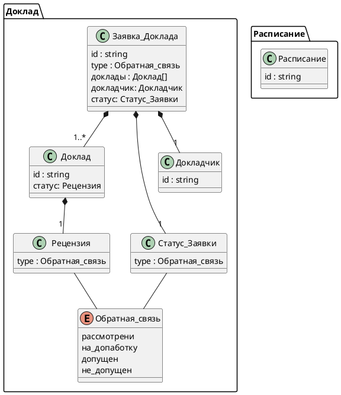

# Модель предметной области
<!-- Логическая модель, содержащая бизнес-сущности предметной области, атрибуты и связи между ними. 
Подробнее: https://confluence.mts.ru/pages/viewpage.action?pageId=375782602

Используется диаграмма классов UML. Документация: https://plantuml.com/class-diagram 
-->

